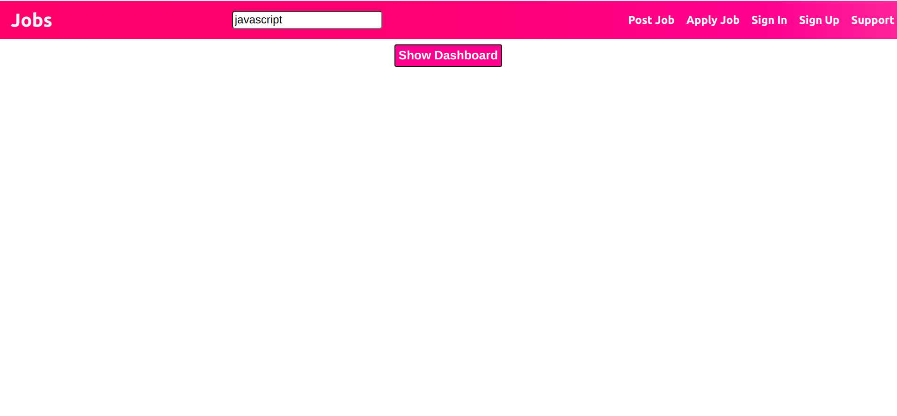
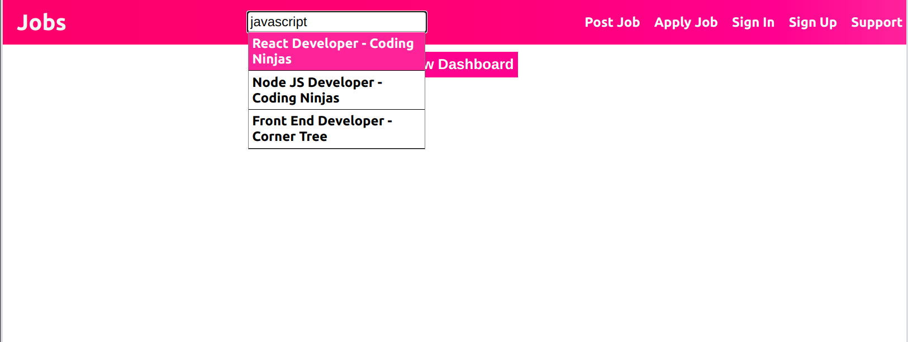
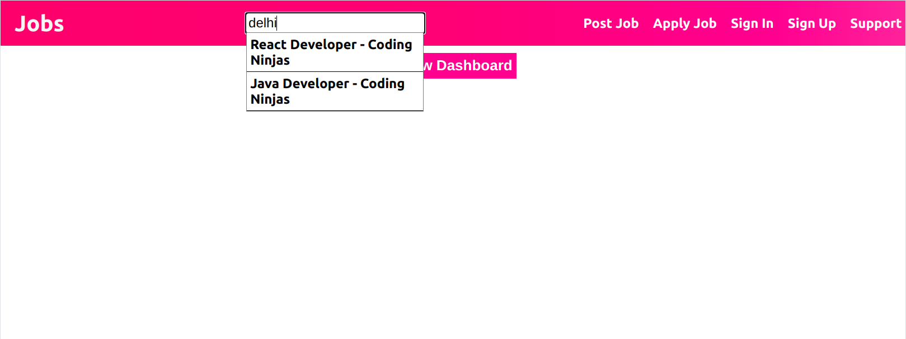
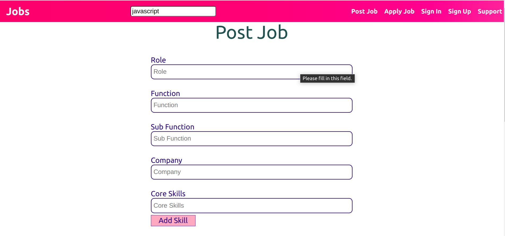
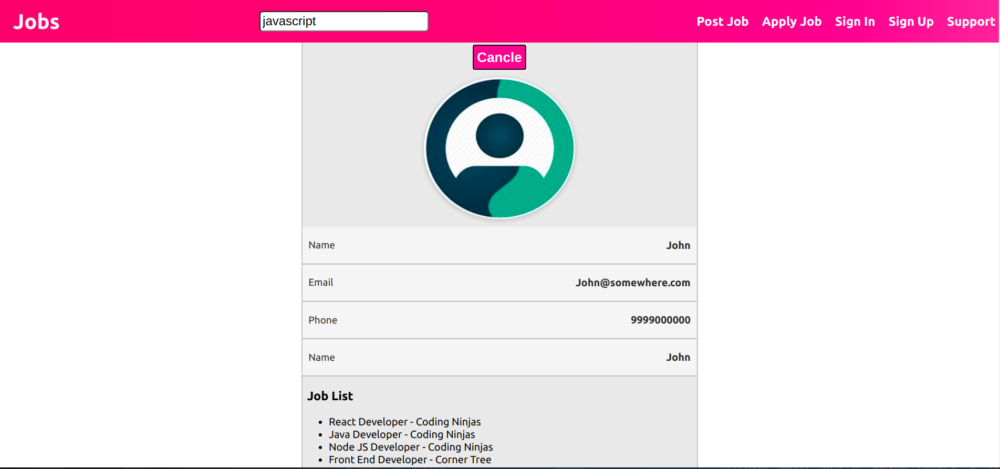

# Job Search

It is a react app for mananging jobs.

# Preview

Link :- https://corner-tree-assignment.web.app/

## Desktop View

### 1.Home



### 2. Search




### 3. Post Job



### 4. Dashboard



# Various Functionality

1. Searching a job based on location, pincode, skills.
2. Creating new job Post.
3. Dash Board.

# Techstack

### HTML, CSS, React, Node JS (API), Mongo DB

# React App Detail :-

### Repository Link :- https://github.com/dheerajk7/corner-tree-react-app.git

### API Hosted Link :- https://corner-tree-assignment.herokuapp.com/api/v1

# Instructions to install

1. Clone this repository from https://github.com/dheerajk7/corner-tree-assignment-api.git .
2. Install NPM if you have not installed yet.
3. Go to project directory and run these commands

   #### To install node Modules

   ```
   npm install
   ```

   #### To run project

   ```
   npm start
   ```

4. Go and check at http://localhost:8000/api/v1.

# Routes

1. /jobs -> To get all the jobs available.
2. /search/:key -> To search job with location, pincode and skills.
3. /create-job -> To post new job.

   ```
   Fields Needed to Create Question :-
   1. role
   2. function
   3. sub_function
   4. company
   5. location
   6. core_skills
   7. soft_skills
   8. compensation
   9. pincode
   10. job_description
   ```

# Directory Structure

`/` - all node API app files <br>
`/config` - all configuration files <br>
`/controllers`- all controllers files <br>
`/models` - all models files <br>
`/routes` - all routes files <br>

---
